# Airflow Banking ETL — Docker Compose (Airflow 3.x resmi, CeleryExecutor)

Dasar compose ini adalah [docker-compose resmi Apache Airflow](https://airflow.apache.org/docs/apache-airflow/stable/howto/docker-compose/index.html)
(CeleryExecutor + Redis + Postgres, arsitektur Airflow 3.x dengan api-server &
dag-processor terpisah), ditambah service custom untuk studi kasus Banking ETL.

## Struktur folder
```
airflow-banking/
├── docker-compose.yaml
├── Dockerfile                 <- extend apache/airflow:3.2.2 + provider postgres + pandas
├── requirements.txt
├── .env-example               <- template untuk file .env
├── config/                    <- custom airflow.cfg (opsional, kosong = default)
├── superset/                  <- apache superset for dashboard
│   └── queries/               <- List query untuk bahan dashboard
│       ├── 01_transaction_analytics.sql
│       ├── 02_customer_360.sql
│       ├── 03_branch_performance.sql
│       ├── 04_channel_analysis.sql
│       ├── 05_product_performance.sql
│       ├── 06_risk_fraud.sql
│   └── Dockerfile
│   └── superset_config.py
│   └── superset_init.sh
├── include/
│   └── dataset/               <- otomatis diisi generate_banking_dataset.py
│   └── script/
│       └── generate_banking_dataset.py
│   └── sql/
│       ├── ddl_staging.sql
│       ├── ddl_dw.sql
│       ├── transform_dim_branches.sql
│       ├── transform_dim_channels.sql
│       ├── transform_dim_date.sql
│       ├── transform_dim_customers.sql
│       ├── transform_dim_accounts.sql
│       └── transform_fact_transaction.sql
├── dags/
│   ├── dag_banking_etl.py
├── logs/
└── plugins/
```

## Star Schema

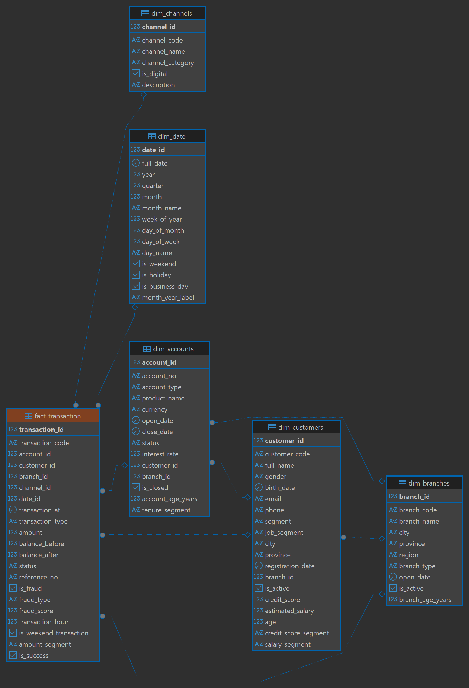

## Service yang berjalan

| Service | Peran |
|---|---|
| `postgres` | metadata DB Airflow |
| `postgres-dw` | data warehouse banking (conn_id `postgres_dw`), expose `localhost:5433` |
| `redis` | broker Celery |
| `airflow-apiserver` | UI + REST API, `localhost:8080` |
| `airflow-scheduler` | scheduling task |
| `airflow-dag-processor` | parsing file DAG (terpisah dari scheduler di Airflow 3) |
| `airflow-worker` | eksekusi task (Celery worker) |
| `airflow-triggerer` | deferred task |
| `airflow-init` | sekali jalan: migrasi DB, membuat user, mengatur Variable & Connection banking |
| `generate-dataset` | sekali jalan: generate 7 CSV (profile `tools`, dijalankan manual) |
| `flower` (opsional) | monitoring Celery, profile `flower` |
| `airflow-cli` (opsional) | akses `airflow` CLI ad-hoc, profile `debug` |

## Langkah menjalankan

1. **Salin file environment:**
   ```bash
   cp .env-example .env
   ```
   Atau di Windows (PowerShell):
   ```powershell
   Copy-Item .env-example .env
   ```

2. **Generate dataset:**
   ```bash
   docker compose run --rm generate-dataset
   ```

3. **(Khusus Linux)** samakan `AIRFLOW_UID` di `.env`:
   ```bash
   sed -i "s/^AIRFLOW_UID=.*/AIRFLOW_UID=$(id -u)/" .env
   ```
   Mac/Windows (Docker Desktop) boleh dilewati.

4. **Build custom image** (berisi `apache-airflow-providers-postgres` + `pandas`):
   ```bash
   docker compose build
   ```

5. **Inisialisasi Airflow** — migrasi DB, membuat user admin, mengatur Variable
   `banking_dataset_path` & Connection `postgres_dw` secara otomatis:
   ```bash
   docker compose up airflow-init
   ```
   Tunggu sampai muncul `Init selesai.` dan container keluar dengan exit code 0.

6. **Jalankan semua service:**
   ```bash
   docker compose up -d
   ```
   (Kalau mau menyalakan Flower juga: `docker compose --profile flower up -d`)

7. **Buka UI**: http://localhost:8080 (login sesuai `.env`, default `airflow` / `airflow`).

   Buka **Admin → Connections → `+`** lalu isi:
   | Field | Value |
   |---|---|
   | Connection ID | `postgres_dw (bebas terserah Anda)` |
   | Connection Type | `Postgres` |
   | Host | `<postgres-dw (docker local)>` |
   | Database | `banking_dw (docker local)` |
   | Login | `<banking (docker local)>` |
   | Password | `<banking123 (docker local)>` |
   | Port | `5433 (docker local)` |
   Klik **Save**.

   Cari DAG `dag_banking_etl`, unpause, klik ▶️ Trigger DAG.

   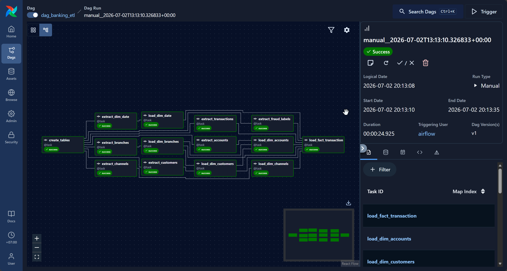

8. **Cek hasil di database** (dari host, via psql/DBeaver):
   ```
   host: localhost | port: 5433 | db: banking_dw | user: banking | password: banking123
   ```

## Perintah berguna

```bash
# Generate ulang dataset
docker compose run --rm generate-dataset

# Lihat log salah satu service
docker compose logs -f airflow-scheduler
docker compose logs -f airflow-worker

# Masuk ke airflow CLI ad-hoc (profile debug)
docker compose run --rm airflow-cli airflow connections list

# Cek koneksi & variable yang ke-set otomatis oleh airflow-init
docker compose exec airflow-apiserver airflow connections get postgres_dw
docker compose exec airflow-apiserver airflow variables get banking_dataset_path

# Hentikan semua (data tetap ada di docker volume)
docker compose down

# Hentikan semua + HAPUS semua data (reset total)
docker compose down -v
```

## Kalau mengubah requirements.txt
```bash
docker compose build
docker compose up -d --force-recreate airflow-apiserver airflow-scheduler airflow-dag-processor airflow-worker airflow-triggerer
```

## Catatan penting

- **`FERNET_KEY`** di `.env` sudah di-generate untuk dev/local. Untuk pemakaian
  di luar laptop sendiri, generate ulang key milikmu sendiri dan jangan commit
  `.env` ke git:
  ```bash
  python3 -c "import base64, os; print(base64.urlsafe_b64encode(os.urandom(32)).decode())"
  ```
- **`AIRFLOW__API_AUTH__JWT_SECRET`** juga hanya nilai default dev — ganti kalau
  environment-nya bisa diakses orang lain.
- **`generate-dataset`** memakai `profiles: [tools]` — sengaja tidak ikut start
  otomatis saat `docker compose up -d`, harus dipanggil manual via `run --rm`.
- Resource minimal yang direkomendasikan Airflow resmi: **4 GB RAM, 2 CPU, 10 GB disk**
  untuk Docker — `airflow-init` akan memberi warning kalau kurang.
- Password `airflow`/`airflow` dan `banking123` di file ini hanya contoh untuk
  lokal/dev — ganti sebelum dipakai di environment yang lebih terbuka.


------------------------------------------------------------------------------
# Setup Superset (terhubung ke DWH yang sudah ada)

Setup ini hanya menjalankan **Superset saja** — tanpa database atau seeder,
karena data warehouse-mu sudah ada. Tiga container:

- `superset_db` — Postgres yang menyimpan metadata Superset sendiri (dashboard,
  user, saved chart). Ini terpisah dari DWH-mu.
- `redis` — layer caching / async query untuk Superset.
- `superset` — aplikasi web Superset, di port 8088.

## 1. Login

Buka **http://localhost:8088**

```
username: admin
password: admin
```

Segera ganti kredensial ini kalau Superset akan diakses dari luar mesinmu.

## 2. Hubungkan ke DWH-mu

Settings → **Database Connections** → **+ Database**, pilih engine-mu, lalu
masukkan detail koneksi DWH yang sudah ada.

**Konfigurasi jaringan tergantung di mana DWH-mu berada:**

| DWH kamu berada di... | Host yang dipakai di Superset |
|---|---|
| Managed cloud DB (RDS, Cloud SQL, Snowflake, BigQuery, dll.) | Hostname publik/VPC normalnya — langsung bisa dipakai |
| Postgres yang jalan langsung di mesinmu (bukan di Docker) | `host.docker.internal` — uncomment dulu blok `extra_hosts` di `docker-compose.yml` |
| Container di project `docker compose` lain | Satukan kedua project ke Docker network yang sama, lalu pakai service name container tersebut sebagai host |
| Sudah di Docker network yang sama | Pakai service name-nya langsung |

**Catatan driver:** image `apache/superset` sudah menyertakan driver Postgres
(`psycopg2`) secara bawaan. Kalau DWH-mu MySQL, Snowflake, BigQuery, Redshift,
dll., kamu perlu menambahkan driver yang sesuai — cara termudah:

```dockerfile
# Dockerfile
FROM apache/superset:latest
USER root
RUN pip install snowflake-sqlalchemy   # atau mysqlclient, redshift_connector, dll.
USER superset
```

lalu ganti `image: apache/superset:latest` menjadi `build: .` di `docker-compose.yml`.

## 3. Membuat dashboard

`./superset/queries/` berisi 6 query SQL referensi yang dipetakan ke pertanyaan analitik
banking yang umum (tren transaksi, customer 360, performa cabang, penggunaan
channel, performa produk, deteksi fraud) — ditulis berdasarkan star schema
(`dim_customers`, `dim_accounts`, `dim_branches`, `dim_channels`, `dim_date`,
`fact_transaction`). Sesuaikan nama tabel/kolom kalau punyamu berbeda, tempel
ke **SQL Lab**, lalu simpan sebagai dataset dan buat chart dari situ.

   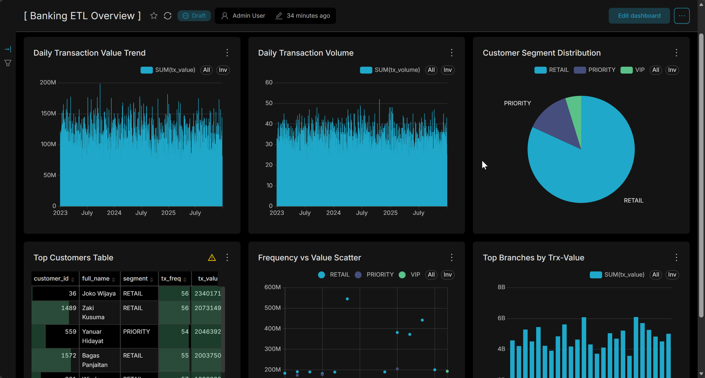

## 4. SQL

`01_transaction_analytics.sql`
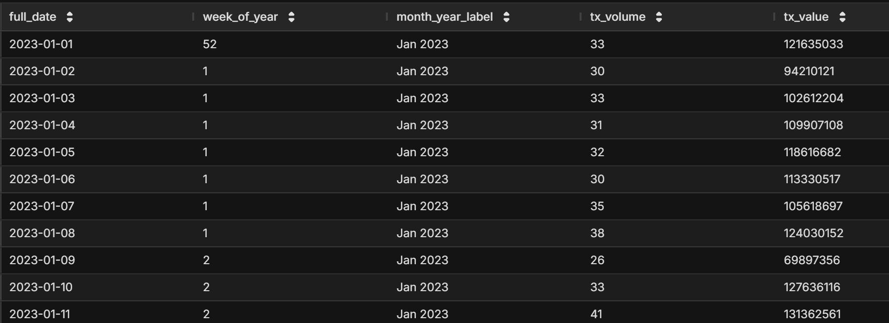

`02_customer_360.sql`
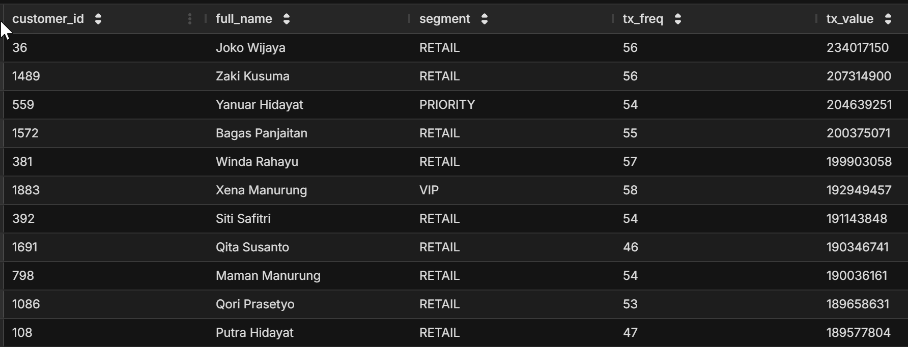
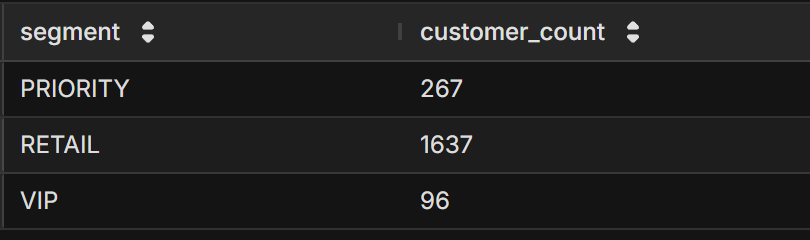

`03_branch_performance.sql`
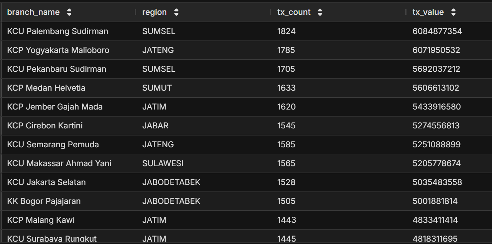

`04_channel_analysis.sql`
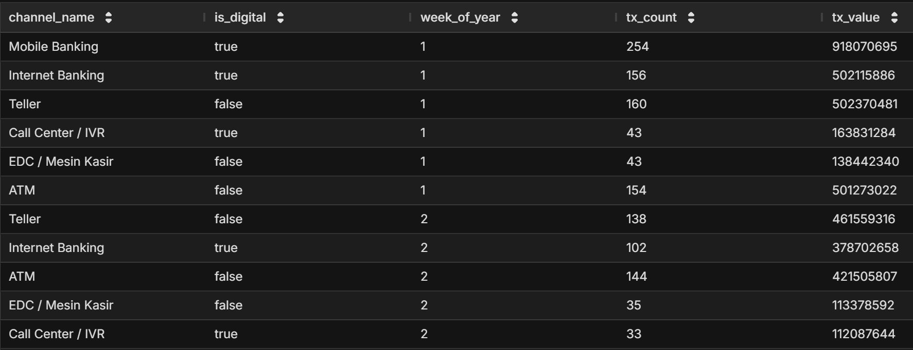

`05_product_performance.sql`
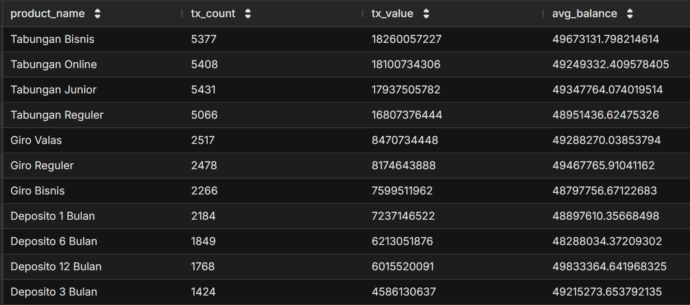

`06_risk_fraud.sql`
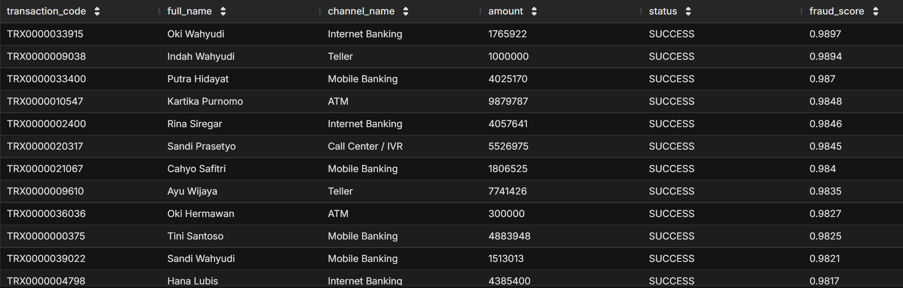
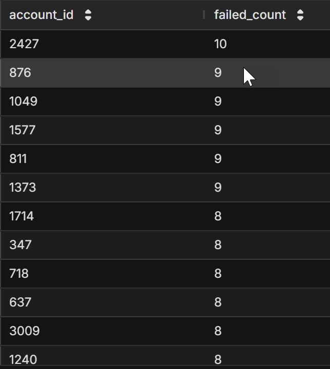
